# De ERD
  ``` mermaid
  erDiagram
    direction LR

    BOOK {
        string ISBN PK "Uniek boeknummer"
        string title
        int publicationYear
    }

    COPY {
        string copyId PK
        string bookId FK
        string status "beschikbaar / uitgeleend / beschadigd"
    }

    AUTHOR {
        string authorId PK
        string name
    }

    BOOK_AUTHOR {
        string bookId PK, FK
        string authorId PK, FK
    }

    CATEGORY {
        string categoryId PK
        string name
    }

    MEMBER {
        string memberId PK
        string name
        string email
    }

    STAFF {
        string staffId PK
        string name
        string role
    }

    ACCOUNT {
        string accountId PK
        string username
        string passwordHash
        string role "member / staff"
    }

    LOAN {
        string loanId PK
        string copyId FK
        string memberId FK
        string staffId FK
        date loanDate
        date returnDate
    }

    RESERVATION {
        string reservationId PK
        date dateRequested
        string status "open / fulfilled / canceled"
    }

    FINE {
        string fineId PK
        float amount
        string reason
        date issuedDate
        string memberId FK
        string loanId FK
    }

    %% RELATIONSHIPS
    BOOK ||--o{ COPY : has
    BOOK ||--o{ BOOK_AUTHOR : includes_author
    AUTHOR ||--o{ BOOK_AUTHOR : contributes_to

    BOOK ||--|| CATEGORY : belongs_to

    COPY ||--o{ LOAN : loaned_as
    MEMBER ||--o{ LOAN : makes
    STAFF ||--o{ LOAN : processes

    MEMBER ||--o{ RESERVATION : places
    BOOK ||--o{ RESERVATION : reserved_for

    MEMBER ||--o{ FINE : receives
    LOAN ||--o{ FINE : results_in

    ACCOUNT ||--|| MEMBER : owns
    ACCOUNT ||--|| STAFF : owns
```

# De REST API 


# De USE CASE

``` mermaid
 flowchart LR
  subgraph Gebruikers
    Gebruiker["👤 Gebruiker"]
    Medewerker["👩‍💼 Bibliotheekmedewerker"]
  end

  subgraph "Use-cases"
    Zoek(Zoek boeken)
    Bekijk(Bekijk boekdetails)
    Reserveer(Reserveer boek)
    Leen(Leen boek)
    Retourneer(Retourneer boek)
    Login(Log in)
    Registreer(Registreer account)
    BeheerBoeken(Beheer boeken)
    BeheerLeden(Beheer leden)
    BeheerReserveringen(Beheer reserveringen)
    VerwerkBoetes(Verwerk boetes)
  end

  Gebruiker --> Zoek
  Gebruiker --> Bekijk
  Gebruiker --> Reserveer
  Gebruiker --> Leen
  Gebruiker --> Retourneer
  Gebruiker --> Login
  Gebruiker --> Registreer

  Medewerker --> Zoek
  Medewerker --> Bekijk
  Medewerker --> Leen
  Medewerker --> Retourneer
  Medewerker --> BeheerBoeken
  Medewerker --> BeheerLeden
  Medewerker --> BeheerReserveringen
  Medewerker --> VerwerkBoetes
```

# De flowchart
``` mermaid
flowchart TD
    Start([Start]) --> Login{Ingelogd?}
    Login -- Ja --> ZoekBoek[📚 Zoek naar een boek]
    Login -- Nee --> Inloggen[🔐 Log in] --> ZoekBoek

    ZoekBoek --> BoekGevonden{Boek gevonden?}
    BoekGevonden -- Nee --> ZoekOpnieuw[🔁 Zoek opnieuw] --> ZoekBoek
    BoekGevonden -- Ja --> Beschikbaar{Boek beschikbaar?}

    Beschikbaar -- Ja --> LeenBoek[✅ Leen het boek]
    Beschikbaar -- Nee --> ReserveerBoek[🕓 Reserveer het boek]

    LeenBoek --> Beëindig[🏁 Klaar]
    ReserveerBoek --> Beëindig
```

#IDE omgeving diagram
```mermaid
%% Gereserveerd voor IDE diagram
```

# De REST API (Resource Map)

