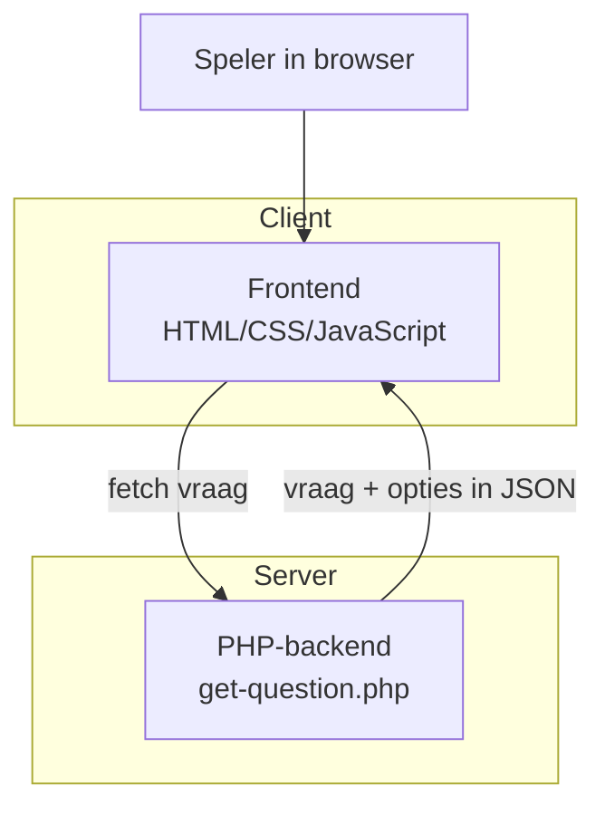
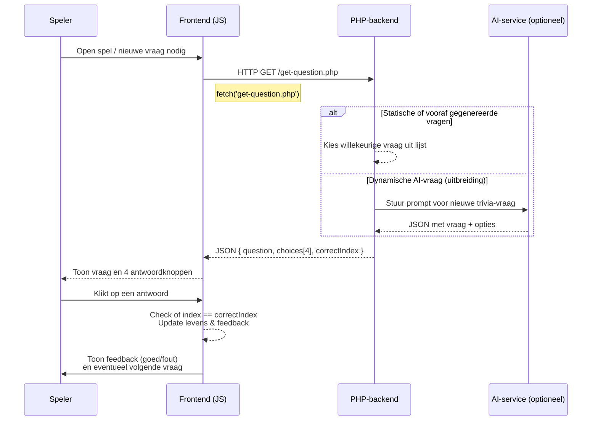

## 1. Applicatie-overzicht - Flow

**Diagram:**

```mermaid
flowchart TD
    U[Speler in browser] --> B[Frontend<br/>HTML/CSS/JavaScript]

    B -->|fetch vraag| P[PHP-backend<br/>get-question.php]

    P -->|vraag + opties in JSON| B

    subgraph Server
        P
    end

    subgraph Client
        B
    end
```

---

## 2. Vraagstroom - Sequence

**Diagram:**

```mermaid
sequenceDiagram
    participant S as Speler
    participant F as Frontend (JS)
    participant P as PHP-backend
    participant AI as AI-service (optioneel)

    S->>F: Open spel / nieuwe vraag nodig
    F->>P: HTTP GET /get-question.php
    Note right of F: fetch('get-question.php')

    alt Statische of vooraf gegenereerde vragen
        P-->>P: Kies willekeurige vraag uit lijst
    else Dynamische AI-vraag (uitbreiding)
        P->>AI: Stuur prompt voor nieuwe trivia-vraag
        AI-->>P: JSON met vraag + opties
    end

    P-->>F: JSON { question, choices[4], correctIndex }
    F-->>S: Toon vraag en 4 antwoordknoppen

    S->>F: Klikt op een antwoord
    F-->>F: Check of index == correctIndex<br/>Update levens & feedback
    F->>S: Toon feedback (goed/fout)<br/>en eventueel volgende vraag
```
